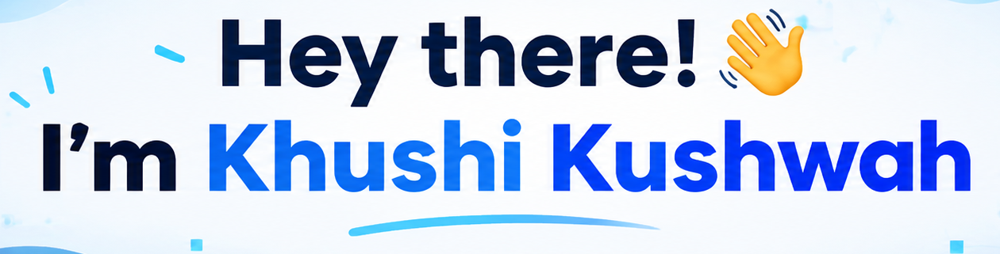

<!-- ===================================================== -->
<!--                  KHUSHI KUSHWAH                       -->
<!--             GITHUB PROFILE README                     -->
<!-- ===================================================== -->

<div align="center">
  <table>
    <tr>
      <td align="center" width="13%">
        
      </td>
      <td align="center" width="90%">
        
      </td>
    </tr>
  </table>

  <h3>🚀 Aspiring Data Scientist | AI & Machine Learning Enthusiast</h3>

  <p>
    
  </p>

  <p>
    <a href="https://www.linkedin.com/in/khushi-kushwah-94420b421/">
      
    </a>
    <a href="mailto:khushikushwah213@gmail.com">
      
    </a>
    <a href="https://github.com/khushikushwah213">
      
    </a>
  </p>

  

</div>

---

## 💫 About Me

```python
class AboutMe:
    def __init__(self):
        self.name = "Khushi Kushwah"
        self.education = "B.S. in Applied AI & Data Science"
        self.institute = "IIT Jodhpur"
        self.year = "2nd Year"
        self.role = "Aspiring Data Scientist 🚀"
        self.interests = [
            "Artificial Intelligence 🤖",
            "Machine Learning 🧠",
            "Data Science 📊",
            "Data Analytics 🔍",
            "Problem Solving 💡",
            "Building Real-World Projects 🛠️"
        ]
        self.currently_learning = [
            "Python 🐍",
            "Data Analysis 📈",
            "Machine Learning 🤖",
            "AI & Emerging Technologies 🌐"
        ]
        self.goals = [
            "Build intelligent, data-driven solutions",
            "Turn data into meaningful insights",
            "Work on innovative real-world projects",
            "Grow into a skilled Data Scientist"
        ]

    def introduce(self):
        print(
            "Hey there! 👋 I'm Khushi, an enthusiastic learner "
            "exploring the world of Data Science and AI. "
            "I love turning curiosity into knowledge, "
            "ideas into projects, and data into insights. "
            "Always learning, always building, and "
            "always looking for the next challenge! 🚀"
        )

me = AboutMe()
me.introduce()
```

🎓 Pursuing a **B.S. in Applied Artificial Intelligence and Data Science at IIT Jodhpur**, with a passion for using technology and analytical thinking to solve meaningful problems.

- 🔭 Currently exploring **Data Science, AI and Machine Learning**
- 🌱 Learning and experimenting with new technologies
- 🧠 Interested in data-driven problem solving and intelligent systems
- 💻 Building independent projects and strengthening my technical skills
- 🎯 Goal: To become a skilled Data Scientist and create impactful solutions
- 🤝 Open to learning, collaboration and exciting opportunities

---

## 🛠️ Tech Stack & Tools

### 🐍 Programming Languages

<p>
  
  
  
  
  
</p>

### 📊 Data Science & Analytics

<p>
  
  
  
  
  
  
  
</p>

### 🤖 AI, Machine Learning & Deep Learning

<p>
  
  
  
  
</p>

### 🗄️ Databases

<p>
  
  
  
  
  
  
</p>

### 💻 Development & Frameworks

<p>
  
  
  
  
  
  
  
  
</p>

### ☁️ Cloud & Deployment

<p>
  
  
  
  
  
  
</p>

### 🔧 Tools & Platforms

<p>
  
  
  
  
  
  
  
</p>

### 🎨 Design & Visualization

<p>
  
  
  
</p>

---

## 🚀 Featured Projects

<div align="center">

  <table>
    <tr>
      <td width="50%" align="center">
        <h3>📊 Data Science Projects</h3>
        <p>Exploring datasets, identifying patterns and extracting meaningful insights through data analysis.</p>
      </td>
      <td width="50%" align="center">
        <h3>🤖 AI & Machine Learning</h3>
        <p>Experimenting with machine learning approaches and developing intelligent, data-driven solutions.</p>
      </td>
    </tr>
    <tr>
      <td width="50%" align="center">
        <h3>📈 Data Visualization</h3>
        <p>Transforming complex data into clear, informative visualizations and interactive dashboards.</p>
      </td>
      <td width="50%" align="center">
        <h3>💡 Independent Projects</h3>
        <p>Turning ideas into practical applications while continuously learning and improving technical skills.</p>
      </td>
    </tr>
  </table>

</div>

> 💡 Explore my repositories to see my projects, experiments and learning journey. More projects coming soon!

---

## 📊 GitHub Statistics

<div align="center">

  

  

  <br/><br/>

  

</div>

---

## 💭 Dev Quote

<div align="center">

  

</div>

---

## 🌐 Let's Connect!

<div align="center">

  <p>💙 I'm always excited to connect with people who love technology, data and innovation.</p>

  <a href="https://www.linkedin.com/in/khushi-kushwah-94420b421/">
    
  </a>

  <a href="mailto:khushikushwah213@gmail.com">
    
  </a>

  <a href="https://github.com/khushikushwah213">
    
  </a>

  <br/><br/>

  <h3>✨ Learn • Build • Explore • Grow ✨</h3>

  <p><i>"The beautiful thing about learning is that nobody can take it away from you."</i></p>

  

</div>
